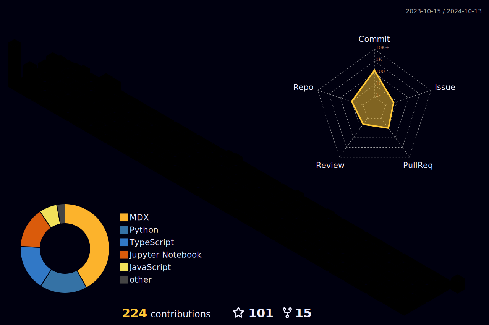

</img>  

<h2 align="center">A Passionate Machine Learning Engineer from Turkey</h2>

- 🧙‍♂️ I'm an AI/ML Engineer [@kloia](https://www.linkedin.com/company/kloia/), and upskilling engineering skills [@mlops-club](https://www.linkedin.com/company/mlops-club/)!
- 🔭 Currently working through the [GPU Mode](https://www.youtube.com/channel/UCJgIbYl6C5no72a0NUAPcTA) lectures to enhance GPU programming skills..
- 🌅 Current Goal: at least one commit a day! 

 

 ## ⭐ Cool projects

<!---* [MIT-Stanford based Self-Taught-Degree](https://github.com/mertbozkir/self-taught-degree)📌 -->
 
<!---* * [👊 Project D: Riot Games Data Science](https://github.com/mertbozkir/Riot-Games-Data-Science) -->
* [MLOps Club RAG 😎](https://github.com/cmagganas/mlops-club-rag)
* [Deku AI friend - Chainlit on AWS ECS and DynamoDB ☁️](https://www.youtube.com/watch?v=lroZqEkjxlA)
* [Legal Vector Search application w/Milvus 🐦](https://github.com/dope-projects/legal-vector-search)
* [MLOps Club - BentoML VScode Extension 📦](https://github.com/mlops-club/vscode-bentoml)
* [Multi-Agent Problem Solver System: Tiny Agents](https://github.com/PanoEvJ/Tiny_Agents/)
* [LLM Agent Swarm!💥](https://github.com/petterle-endeavors/llm-cdk-app-agent)
* [open-source-chat: Documentation Chatbot](https://github.com/mertbozkir/open-source-chat)

 

### 🔥 Recent Activity
<!--START_SECTION:activity-->
1. 🗣 Commented on [#9](https://github.com/microsoft/mssql-python/issues/9#issuecomment-3193411963) in [microsoft/mssql-python](https://github.com/microsoft/mssql-python)
2. 🗣 Commented on [#3509](https://github.com/huggingface/trl/issues/3509#issuecomment-3175415009) in [huggingface/trl](https://github.com/huggingface/trl)
3. 🗣 Commented on [#2618](https://github.com/huggingface/accelerate/issues/2618#issuecomment-3001193243) in [huggingface/accelerate](https://github.com/huggingface/accelerate)
4. 🗣 Commented on [#2618](https://github.com/huggingface/accelerate/issues/2618#issuecomment-3000589473) in [huggingface/accelerate](https://github.com/huggingface/accelerate)
5. 🎉 Merged PR [#2](https://github.com/cmagganas/mlops-club-rag/pull/2) in [cmagganas/mlops-club-rag](https://github.com/cmagganas/mlops-club-rag)
<!--END_SECTION:activity-->

## 📬 Connect with me:

&nbsp;
&nbsp;
&nbsp;
&nbsp;
&nbsp;
&nbsp;

<!--

  
  

-->
